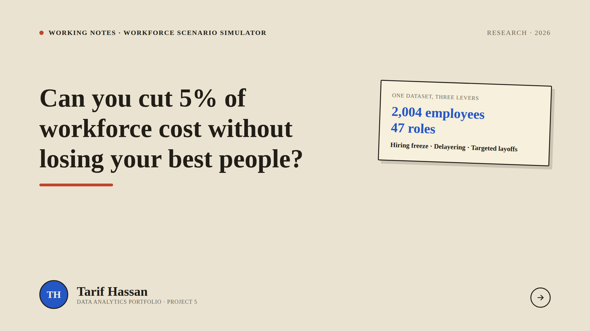
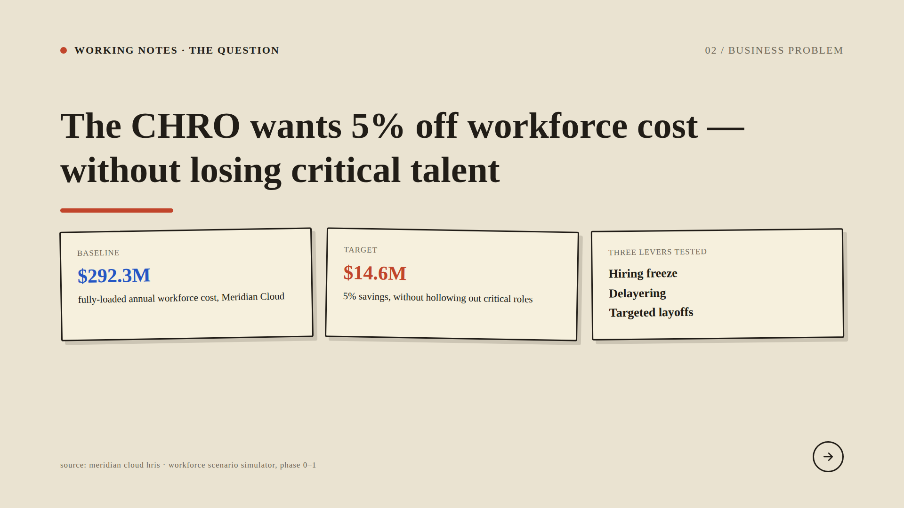
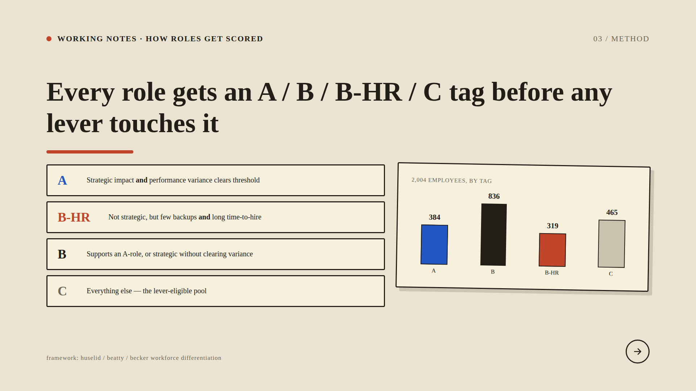
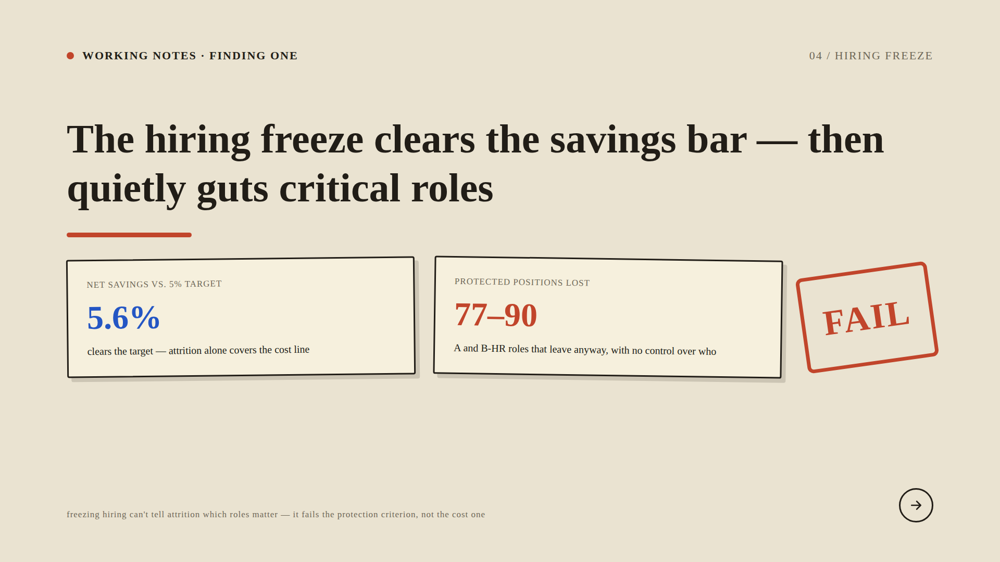
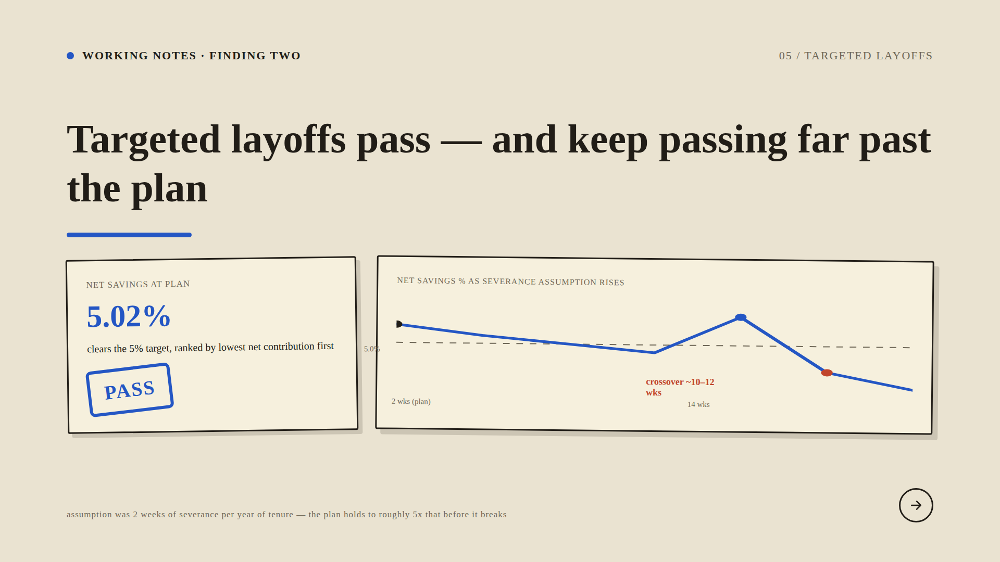
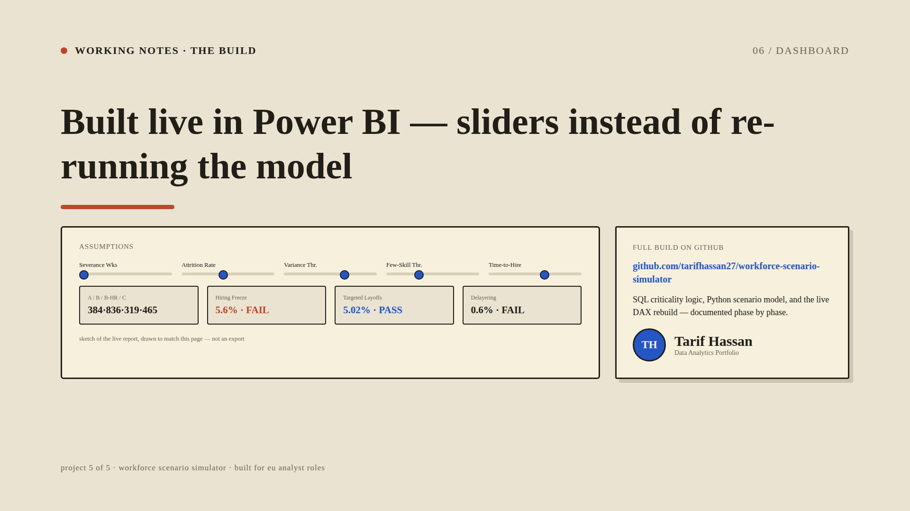

# Workforce Scenario Simulator

A decision-support model for a hypothetical CHRO question: **can you cut 5% of workforce
cost without losing your critical talent?** Built end to end — synthetic HRIS data, SQL
role-criticality logic, a Python scenario model, a sensitivity analysis, and a live
slider-driven Power BI dashboard — for a fictional ~2,000-employee company, Meridian Cloud.



## Business Problem

Meridian Cloud's CHRO has been asked to cut workforce cost by 5% — about **$14.6M** off a
**$292.3M** fully-loaded annual cost base — without quietly gutting the roles the business
actually depends on. The brief tests three commonly reached-for levers against that single
pass/fail bar: a **hiring freeze**, **delayering** (removing a layer of management), and
**targeted layoffs**. A lever only "works" if it clears the savings target *and* loses zero
critical positions.



## Method

Before any lever touches the workforce, every one of the 2,004 employees across 47 roles is
scored against a modified Huselid/Beatty/Becker workforce-differentiation framework:

- **A** — strategic impact *and* performance variance clears a threshold
- **B-HR** — not strategic, but few qualified backups *and* a long time-to-hire (hard to replace)
- **B** — supports an A-role, or is strategic without clearing the variance bar
- **C** — everything else; the only pool any lever is allowed to touch

This split (384 / 836 / 319 / 465) is derived in SQL from raw HRIS fields — rating variance,
replaceability thresholds, and a seeded business-judgment flag — not assumed.



## Finding 1 — Hiring Freeze

A blanket hiring freeze (no exemptions) clears the cost line: attrition alone delivers
**~5.6%** in savings. But because it can't distinguish a departing critical employee from
anyone else, it costs **77–90 protected (A / B-HR) positions** across the seeds tested, with
zero control over who. **Verdict: FAIL** — it fails the protection criterion, not the cost one.



## Finding 2 — Targeted Layoffs

Ranking the eligible C-role pool by lowest net contribution first and laying off from the
bottom clears the target at **5.02%** savings with zero protected-role losses. **Verdict: PASS.**
A sensitivity sweep on the severance assumption (2 weeks per year of tenure) shows the plan
holds up to roughly **5x** that assumption — the pass/fail crossover doesn't happen until
10–12 weeks — making this the most robust of the three levers by a wide margin.

*(Delayering was also tested: it protects everyone but only saves 0.61% of baseline — FAIL
on the cost criterion. Not slider-driven in the dashboard since its parameters weren't in
scope for v1; see `04_scenario_model/`.)*



## Live Dashboard

All of the above is rebuilt live in Power BI: five What-If Parameter sliders (severance
weeks, attrition rate, and the three criticality thresholds) drive DAX measures that
reproduce the SQL and Python results in real time, so a reviewer can stress-test the
assumptions without re-running anything. Full build notes, including three real DAX bugs
hit and fixed along the way and why targeted layoffs ended up as a precomputed lookup table
instead of a live running total, are in [`05_powerbi/phase6_notes.md`](../05_powerbi/phase6_notes.md).



## Repo structure

```
01_business_problem/   problem statement, scope, and lever definitions
02_data/                synthetic company + employee data generation
03_sql/                 role-criticality logic (A/B/B-HR/C)
04_scenario_model/      Python lever simulations + sensitivity analysis
05_powerbi/              live DAX rebuild, Phase 6 build notes
06_executive_brief/     this README, the LinkedIn carousel deck (PDF + PNGs)
```

Built by [Tarif Hassan](https://github.com/tarifhassan27) — Project 5 of a data analytics
portfolio aimed at EU analyst roles.
